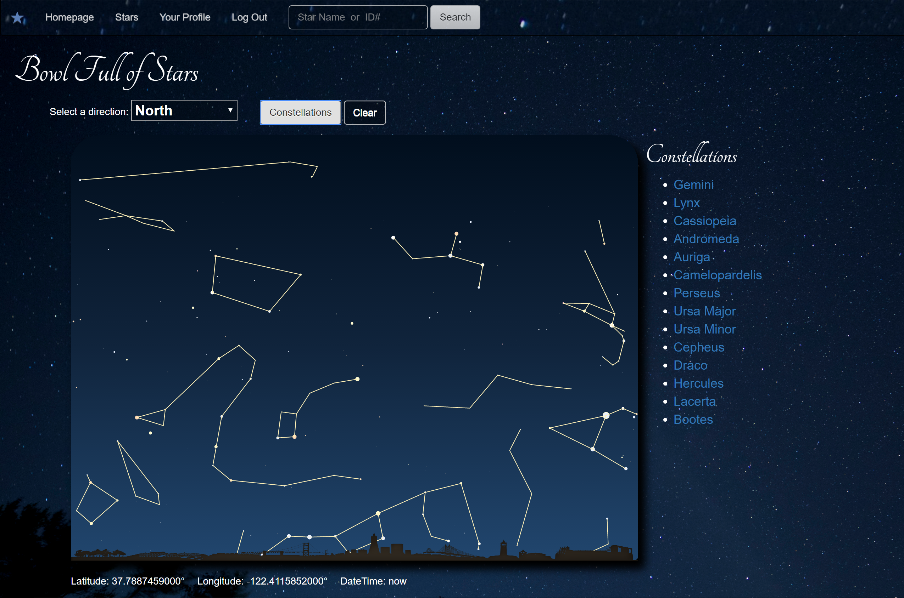

# Bowl Full of Stars
Bowl Full of Stars is the 4 week project that I completed during my time as an software engineering fellow at Hackbright.  Bowl Full of Stars is a web app that generates an image of the stars in the sky as viewed from different locations and times of day.  Users can create an account and save thier home location so that it will automatically generate the sky at that location when they are logged in.  


##Contents
* [Technologies](#technologies)
<!-- * [Database Model](#database model) -->
* [Features](#features)
* [Installation](#install)

## <a name="technologies"></a>Technologies
<b>Backend:</b> Python, Flask, PostgreSQL, SQLAlchemy<br/>
<b>Frontend:</b> JavaScript, jQuery, AJAX, Jinja, Bootstrap, HTML5, CSS<br/>
<b>APIs:</b> Google Maps<br/>

## <a name="database model"></a>Database Model

## <a name="features"></a>Features

The sky maps are viewable in four directions, the current direction is visible in the dropdown menu above the sky image


A button can be clicked to view the Constellations


## <a name="features"></a>Installation
To run Bowl Full of Stars:

Install PostgreSQL

Clone or fork this repo:

```
https://github.com/ZoeShirah/Star_Project
```

Create and activate a virtual environment inside your directory:

```
virtualenv env
source env/bin/activate
```

Install the dependencies:

```
pip install -r requirements.txt
```
Sign up to use the Google Maps API (https://developers.google.com/maps/)

Save your API key in a file called <kbd>secrets.sh</kbd> using this format:
```
export GOOGLE_API_KEY="YOUR_KEY_GOES_HERE"
```
Source your keys from your secrets.sh file into your virtual environment:

```
source secrets.sh
```

Set up the database:

```
python model.py
```

Run the app:

```
python server.py
```

You can now navigate to 'localhost:5000/' to access Recruiter.


